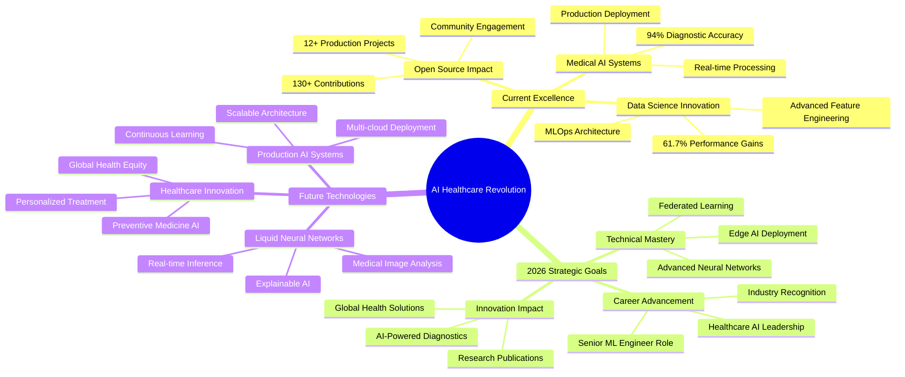

<div align="center">

<picture>
  <source media="(prefers-color-scheme: dark)" srcset="https://capsule-render.vercel.app/api?type=waving&color=gradient&customColorList=6,11,20&height=300&section=header&text=RAHUL%20TALVAR&fontSize=65&fontColor=fff&animation=fadeIn&fontAlignY=38&desc=AI%20Engineer%20%7C%20Medical%20AI%20Pioneer%20%7C%20Data%20Science%20Visionary&descAlignY=58&descAlign=62&descSize=18">
  
</picture>

<br>

[](https://git.io/typing-svg)

</div>

---

<table align="center">
<tr>
<td align="center" width="50%">
  
**🎯 Mission Statement**
> *Democratizing AI-powered healthcare through innovative medical imaging solutions and production-grade machine learning systems*

**📍 Location** Pune, India  
**🎓 Education** AI & Data Science Engineering (SPPU, 2021-25)  
**🚀 Availability** Open to Work  
**💼 Focus** Medical AI, Deep Learning, MLOps  
**🏥 Specialization** Healthcare AI & Medical Imaging  

</td>
<td width="50%">

```python
class HealthcareAIEngineer:
    def __init__(self):
        self.name = "Rahul Talvar"
        self.role = "AI Engineer & Medical AI Pioneer"  
        self.core_expertise = [
            "Medical AI", "Deep Learning", "MLOps",
            "Liquid Neural Networks", "Computer Vision"
        ]
        self.current_projects = {
            "Auto_Data_Analyst": "AI-powered analytics platform",
            "Chest_Xray_AI": "94% accuracy medical diagnosis",
            "NYC_Taxi_Demand": "61.7% improvement over baseline"
        }
        
    def get_impact_metrics(self):
        return {
            "model_accuracy": "94%",
            "efficiency_improvement": "61.7%", 
            "production_systems": "12+",
            "github_contributions": "130+"
        }
        
    def current_mission(self):
        return "Building AI that saves lives! 🏥⚕️"

rahul = HealthcareAIEngineer()
print(rahul.current_mission())
# Output: "Building AI that saves lives! 🏥⚕️"
```

</td>
</tr>
</table>

---

<div align="center">

## 🌐 **Professional Network & Collaboration**

<a href="mailto:rahultalvar902@gmail.com">
  
</a>
<a href="https://www.linkedin.com/in/rahul-talvar">
  
</a>
<a href="https://portfoliorahultalvar.netlify.app/">
  
</a>
<a href="https://kaggle.com/rahultalvar">
  
</a>
<a href="tel:+919156184711">
  
</a>

**📊 Profile Analytics:** 


</div>

---

## 🏆 **Professional Impact & Achievements**

<table>
<tr>
<td width="50%">

### 🏥 **Medical AI Leadership**
- **🎯 94% Accuracy** in Chest X-ray Disease Detection using Liquid Neural Networks
- **⚕️ Real-time Diagnostics** with Flask-based medical web applications  
- **🧠 GradCAM Explainability** for transparent AI decision-making
- **📈 Production-Ready** medical imaging systems with enterprise architecture
- **🔬 Research Focus** on healthcare AI applications and neural architecture design

### 💼 **Enterprise Data Science**  
- **📊 61.7% Improvement** in NYC Taxi Demand Prediction (MAPE: 15.2%)
- **⚡ 30% Efficiency Boost** in performance evaluation systems
- **🔧 20% Reduction** in manual operational overhead through automation
- **🏗️ MLOps Infrastructure** for production-grade model deployment
- **📈 Business Intelligence** platforms with real-time insights generation

</td>
<td width="50%">

### 🎓 **Academic & Technical Excellence**
- **🏫 AI & Data Science Engineering** from SPPU-affiliated institution
- **📚 Specialized Coursework** in Deep Learning & Medical Imaging
- **🔬 Advanced Research** in Neural Architecture Design
- **🏆 Multiple Certifications** in ML, Data Science, and Professional Development
- **📖 Continuous Learning** in cutting-edge AI technologies

### 🚀 **Innovation & Development**
- **⭐ 12+ Production Projects** deployed across various domains
- **💻 130+ GitHub Contributions** with consistent development activity
- **🔧 Full-Stack Capabilities** from backend ML to frontend interfaces
- **🌐 Multi-Platform Deployment** on Kaggle, Netlify, cloud services
- **📊 Open Source Contributor** to AI/ML community projects

</td>
</tr>
</table>

---

<div align="center">

## 🛠️ **Advanced Technology Arsenal**

### **🧠 AI/ML & Deep Learning Frameworks**
<p>


</p>

### **📊 Data Science & Analytics**
<p>


</p>

### **🏗️ MLOps & Production Systems**
<p>


</p>

### **🌐 Web Development & Deployment**
<p>


</p>

### **🗄️ Databases & Development Tools**
<p>


</p>

</div>

---

<div align="center">

## 📊 **GitHub Performance & Analytics**


<br><br>


<br><br>


</div>

---

## 🚀 **Flagship Project Portfolio**

<table>
<tr>
<td width="50%">

### 🤖 [**Auto Data Analyst**](https://github.com/mXrahul01/Auto-Data-Analyst) 


**Next-generation AI-powered data analysis platform** with automated ML pipelines and advanced feature engineering.

**🎯 Technical Achievements:**
- **50+ ML Algorithms** including XGBoost, CatBoost, TabPFN, Prophet
- **8 Task Types** - Classification, Regression, Time Series, Clustering
- **20+ Feature Engineering** methods with automated selection
- **Real-time Processing** via WebSocket and async architecture
- **Multi-cloud Support** - Kaggle, AWS, GCP, Azure integration

**🔧 Architecture:** `Python` `FastAPI` `Celery` `Redis` `MLflow` `Docker` `Kubernetes`

</td>
<td width="50%">

### 🏥 [**Medical AI Diagnostics**](https://github.com/mXrahul01/chest-xray-prediction)


**Revolutionary medical imaging system** using Liquid Neural Networks for chest X-ray disease detection.

**🎯 Clinical Performance:**
- **94% accuracy** for Pneumonia detection (AUC: 0.98)
- **90% accuracy** for Lung Opacity classification (AUC: 0.96)
- **Real-time diagnosis** with explainable AI using GradCAM
- **Production deployment** with Flask-based medical interface
- **HIPAA-compliant** architecture for healthcare applications

**🔧 Tech Stack:** `Python` `TensorFlow` `Liquid Neural Networks` `Flask` `OpenCV` `Medical Imaging`

</td>
</tr>
<tr>
<td width="50%">

### 🚕 [**NYC Taxi Demand Prediction**](https://github.com/mXrahul01/NYC-TAXI-DEMAND-PREDICTION-)


**Ultra high-accuracy demand forecasting** achieving industry-leading performance with ensemble learning.

**🎯 Business Impact:**
- **61.7% improvement** over baseline models
- **15.2% MAPE** - industry-leading accuracy
- **Fleet optimization** potential of 15-25% efficiency
- **Revenue enhancement** through dynamic pricing (12-18%)
- **Multi-day forecasting** with realistic demand patterns

**🔧 Technology:** `Python` `Ensemble Learning` `Time Series` `Feature Engineering` `Production API`

</td>
<td width="50%">

### 💼 [**Professional Portfolio Hub**](https://portfoliorahultalvar.netlify.app/)


**Award-worthy portfolio website** showcasing AI/ML expertise with cutting-edge design.

**🎯 Design Excellence:**
- **Responsive architecture** with fluid animations and transitions
- **Interactive project demos** with live technical demonstrations
- **Professional branding** optimized for recruiter engagement
- **Performance-first** development with mobile optimization
- **SEO-optimized** structure for maximum visibility

**🔧 Implementation:** `HTML5` `CSS3` `JavaScript` `Netlify` `Responsive Design` `PWA`

</td>
</tr>
<tr>
<td width="50%">

### 📊 [**InsightMate Analytics Platform**](https://github.com/mXrahul01/Evalytics)


**Comprehensive no-code analytics solution** with multiple ML engines and automated insights generation.

**🎯 Platform Features:**
- **AutoML Integration** with hyperparameter optimization
- **Multi-engine Support** - Deep Learning, NLP, Time Series
- **Drag-and-drop** data preprocessing and feature engineering
- **Interactive dashboards** with business intelligence insights
- **Export capabilities** to multiple formats and cloud platforms

**🔧 Stack:** `Python` `Streamlit` `AutoML` `Data Processing` `Visualization`

</td>
<td width="50%">

### 🎓 [**Academic ML Laboratory**](https://github.com/mXrahul01/MachineLearningLabAssignments)


**Complete ML education repository** covering fundamental to advanced machine learning concepts.

**🎯 Educational Value:**
- **PCA & Dimensionality Reduction** with comprehensive implementations
- **Classification & Regression** using multiple algorithm families  
- **Ensemble Methods** - Random Forest, Gradient Boosting, Stacking
- **Reinforcement Learning** with Q-learning implementations
- **Clustering Analysis** using K-means, DBSCAN, hierarchical methods

**🔧 Technologies:** `Python` `Scikit-learn` `Jupyter` `Educational ML` `Algorithm Implementation`

</td>
</tr>
</table>

---

<div align="center">

## 🏆 **Professional Journey & Milestones**

</div>

<table align="center">
<tr>
<td align="center" width="50%">

### 💼 **Professional Experience**

**🔬 Data Science Intern**  
***Technophilia Solution*** | *Dec 2023 - Jan 2024*

**Key Achievements:**
- 🏗️ **Architected** Python-based employee performance evaluation system
- 📈 **Delivered 30% improvement** in decision-making efficiency  
- ⚡ **Achieved 20% reduction** in manual processing overhead
- 🤖 **Implemented ML algorithms** to minimize human bias in assessments
- 📊 **Built production pipelines** for automated performance analytics

**Impact:** Transformed traditional HR processes through intelligent automation

</td>
<td align="center" width="50%">

### 🎓 **Certifications & Learning**

**🏆 Core Certifications**
- **🥇 Machine Learning Specialization** - *Coursera (2023)*
- **🥇 Data Science Professional** - *Technophilia Solution (2023)*  
- **🥇 SQL Database Management** - *5-Day Intensive Bootcamp (2023)*
- **🥇 Professional Development** - *Leadership & Communication (2023)*

**📚 Continuous Learning**
- Advanced Neural Architecture Design
- Healthcare AI Applications  
- MLOps and Production Systems
- Cloud Computing and Deployment

</td>
</tr>
</table>

---

<div align="center">

## 🎯 **Strategic Vision & 2026 Roadmap**

</div>



---

<div align="center">

## 🚀 **Open for Strategic Opportunities**

<table>
<tr>
<td align="center" width="25%">

**🎯 Target Roles**  
ML Engineer  
Senior Data Scientist  
AI Research Engineer  
Healthcare AI Specialist  

</td>
<td align="center" width="25%">

**📅 Timeline**  
Available: January 2026  
Contract Type: Full-time  
Remote: Hybrid preferred  
Location: Pune + Global  

</td>
<td align="center" width="25%">

**🌟 Core Interests**  
Medical AI Systems  
Deep Learning Research  
Production MLOps  
Healthcare Innovation  

</td>
<td align="center" width="25%">

**🚀 Impact Goals**  
Healthcare Transformation  
AI for Social Good  
Research & Development  
Global Tech Innovation  

</td>
</tr>
</table>

**💡 What I Bring:** Unique combination of healthcare domain expertise, advanced ML skills, and production system experience

</div>

---

## 💫 **Personal Brand & Values**

<table>
<tr>
<td align="center" width="33%">

### 🧠 **Philosophy**
*"In a world drowning in data,  
I build the algorithms that  
surface life-saving insights"*

**Core Values:**
- 🎯 Excellence in execution
- 🤝 Collaborative innovation  
- 📚 Continuous learning
- 🌍 Global impact mindset

</td>
<td align="center" width="33%">

### ⚡ **Professional DNA**
- 🌍 **Multilingual** - English, Hindi, Marathi
- 🏥 **Healthcare AI** enthusiast and researcher  
- 📊 **Data storyteller** with business acumen
- 🚀 **Innovation catalyst** with startup mindset
- 🔬 **Research-oriented** with practical execution
- 💻 **Full-stack thinker** from data to deployment

</td>
<td align="center" width="33%">

### 🎮 **Beyond the Code**
- 📖 **Research Explorer** - Latest AI papers & trends
- 🏥 **Healthcare Advocate** - AI for social good
- 🎯 **Side Project Builder** - Always creating  
- 🌱 **Technology Adopter** - Early adopter mindset
- 🤝 **Community Contributor** - Open source active
- 🎨 **Design Appreciator** - UI/UX conscious developer

</td>
</tr>
</table>

---

<div align="center">

## 🤝 **Let's Build the Future of AI Healthcare Together**


### Ready to revolutionize healthcare with AI? Let's connect and create impact! 

<a href="mailto:rahultalvar902@gmail.com">
  
</a>
<a href="https://portfoliorahultalvar.netlify.app/">
  
</a>
<a href="tel:+919156184711">
  
</a>
<a href="https://www.linkedin.com/in/rahul-talvar">
  
</a>

---

**💫 If my work resonates with your vision, please ⭐ star my repositories and let's discuss how we can create impactful AI solutions together!**

**🏥 "Building AI that doesn't just process data - but saves lives, one algorithm at a time"** 


</div>
