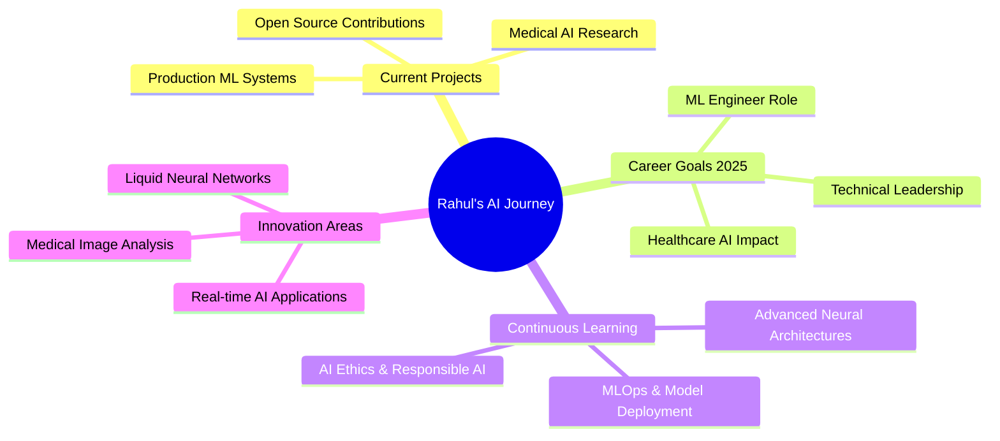

<div align="center">


<br>

[](https://git.io/typing-svg)

</div>

---

<table align="center">
<tr>
<td>
  
**🎯 Current Mission**
> Crafting intelligent AI solutions that bridge the gap between cutting-edge technology and real-world healthcare impact

**📍 Based in** Pune, India  
**🎓 Background** AI & Data Science Engineering (SPPU)  
**🚀 Available** January 2026  
**💡 Passion** Medical AI & Deep Learning Innovation

</td>
<td width="300">

```python
class DataScientist:
    def __init__(self):
        self.name = "Rahul Talvar"
        self.role = "ML Engineer"
        self.language_spoken = ["en_US", "hi_IN", "mr_IN"]
        
    def say_hi(self):
        print("Building the future, one algorithm at a time!")
        
    def current_focus(self):
        return ["Medical AI", "Liquid Neural Networks", "Production ML"]

me = DataScientist()
me.say_hi()
```

</td>
</tr>
</table>

---

<div align="center">

## 🌐 Let's Connect & Collaborate

<a href="mailto:rahultalvar902@gmail.com">
  
</a>
<a href="https://www.linkedin.com/in/rahul-talvar">
  
</a>
<a href="https://portfoliorahultalvar.netlify.app/">
  
</a>
<a href="https://kaggle.com/rahultalvar">
  
</a>
<a href="tel:+919156184711">
  
</a>

</div>

---

## 🎯 Professional Highlights

<table>
<tr>
<td width="50%">

### 🏥 **Medical AI Pioneer**
- **94% Accuracy** in Chest X-ray Disease Detection
- Revolutionary **Liquid Neural Networks** implementation
- Real-time diagnostic web applications
- Bridging AI and Healthcare for patient impact

### 💼 **Data Science Impact**  
- **30% efficiency improvement** in performance evaluation systems
- **20% reduction** in manual operational overhead
- Enterprise-grade ML pipeline development
- Production-ready Flask applications

</td>
<td width="50%">

### 🎓 **Academic Excellence**
- **AI & Data Science Engineering** (SPPU)
- Specialized in Deep Learning & Medical Imaging
- Advanced coursework in Neural Architecture Design
- Research focus on Healthcare AI Applications

### 🏆 **Professional Growth**
- **Data Science Intern** at Technophilia Solution
- Multiple **ML Specialization Certifications**
- Active contributor to **Open Source AI projects**
- Continuous learning in cutting-edge technologies

</td>
</tr>
</table>

---

<div align="center">

## 🛠️ **Technology Arsenal**

### **Core Programming & Data Science**
<p>

</p>

### **Machine Learning & AI Frameworks**
<p>


</p>

### **Data Visualization & Analytics**
<p>


</p>

### **Web Development & Deployment**
<p>

</p>

### **Database & Cloud Technologies**
<p>

</p>

</div>

---

<div align="center">

## 📊 **GitHub Performance Metrics**


<br><br>


<br><br>


</div>

---

## 🚀 **Flagship Projects**

<table>
<tr>
<td width="50%">

### 🏥 [**MedAI Diagnostics Platform**](https://github.com/mXrahul01/chest-xray-prediction)


Revolutionary medical AI system leveraging **Liquid Neural Networks** for chest X-ray analysis.

**🎯 Key Achievements:**
- **94% accuracy** for Pneumonia detection (AUC: 0.98)
- **90% accuracy** for Lung Opacity classification (AUC: 0.96)
- Real-time Flask web interface for medical professionals
- Explainable AI with GradCAM visualizations

**🔧 Tech Stack:** `Python` `TensorFlow` `Liquid Neural Networks` `Flask` `OpenCV` `Medical Imaging`

</td>
<td width="50%">

### 💰 [**SmartLend Risk Engine**](https://github.com/mXrahul01/loan-default-analysis)


Advanced predictive modeling system for financial risk assessment with actionable business insights.

**🎯 Key Achievements:**
- Comprehensive feature engineering pipeline
- Advanced ensemble methods for risk prediction
- Interactive dashboards for decision support
- Deployment-ready MLOps infrastructure

**🔧 Tech Stack:** `Python` `Scikit-learn` `XGBoost` `Pandas` `Streamlit` `MLOps`

</td>
</tr>
<tr>
<td width="50%">

### 🚗 [**Urban Mobility Analytics**](https://github.com/mXrahul01/uber-data-analysis)


Comprehensive data science project analyzing urban transportation patterns for operational optimization.

**🎯 Key Achievements:**
- Advanced time-series analysis and forecasting
- Geospatial data visualization and mapping
- Business intelligence dashboard development
- Actionable insights for operational efficiency

**🔧 Tech Stack:** `Python` `Pandas` `Matplotlib` `Seaborn` `Folium` `Plotly`

</td>
<td width="50%">

### 💼 [**Portfolio Showcase**](https://portfoliorahultalvar.netlify.app/)


Professional portfolio website showcasing AI/ML expertise with modern design and interactive elements.

**🎯 Key Features:**
- Responsive design with smooth animations
- Project showcases with live demonstrations
- Professional branding and visual identity
- Mobile-optimized user experience

**🔧 Tech Stack:** `HTML5` `CSS3` `JavaScript` `Netlify` `Responsive Design`

</td>
</tr>
</table>

---

<div align="center">

## 🏆 **Professional Journey & Certifications**

</div>

<table align="center">
<tr>
<td>

### 💼 **Experience**

**🔬 Data Science Intern**  
*Technophilia Solution* | Dec 2023 - Jan 2024
- Architected Python-based employee performance evaluation system
- **Delivered 30% improvement** in decision-making efficiency
- **Achieved 20% reduction** in manual processing overhead
- Implemented ML algorithms to minimize human bias in assessments

</td>
<td>

### 🎓 **Certifications**

- **🥇 Machine Learning Specialization** - *Coursera (2023)*
- **🥇 Data Science Professional** - *Technophilia Solution (2023)*
- **🥇 SQL Database Management** - *5-Day Intensive Bootcamp (2023)*
- **🥇 Professional Development** - *Leadership & Communication (2023)*

</td>
</tr>
</table>

---

<div align="center">

## 🎯 **Current Focus & 2025 Vision**

</div>



<div align="center">

### 🚀 **Seeking Opportunities**

<table>
<tr>
<td align="center" width="25%">

**🎯 Role**  
ML Engineer  
Data Scientist  

</td>
<td align="center" width="25%">

**📅 Availability**  
January 2026  
Full-time  

</td>
<td align="center" width="25%">

**🌟 Interests**  
Medical AI  
Deep Learning  

</td>
<td align="center" width="25%">

**🚀 Impact**  
Healthcare Innovation  
Production AI Systems  

</td>
</tr>
</table>

</div>

---

<div align="center">

## 💫 **Fun Facts & Personal Touch**

<table>
<tr>
<td align="center" width="33%">

### 🧠 **Quote**
*"In a world full of data,  
be the algorithm that  
finds the pattern"*

</td>
<td align="center" width="33%">

### ⚡ **Quick Facts**
- 🌍 Fluent in 3 languages
- 🏥 Healthcare AI enthusiast  
- 📚 Research paper reader
- 🚀 Innovation-driven mindset

</td>
<td align="center" width="33%">

### 🎮 **When Not Coding**
- 📖 Reading AI research papers
- 🏥 Exploring medical datasets
- 🎯 Building side projects
- 🌱 Learning new frameworks

</td>
</tr>
</table>

</div>

---

<div align="center">

## 🤝 **Let's Build Something Amazing Together**


### Ready to collaborate on your next AI project? Let's connect!

<a href="mailto:rahultalvar902@gmail.com">
  
</a>
<a href="https://portfoliorahultalvar.netlify.app/">
  
</a>
<a href="tel:+919156184711">
  
</a>

---


**💫 Thanks for visiting! Star ⭐ my repositories if you find my work interesting!**

</div>
